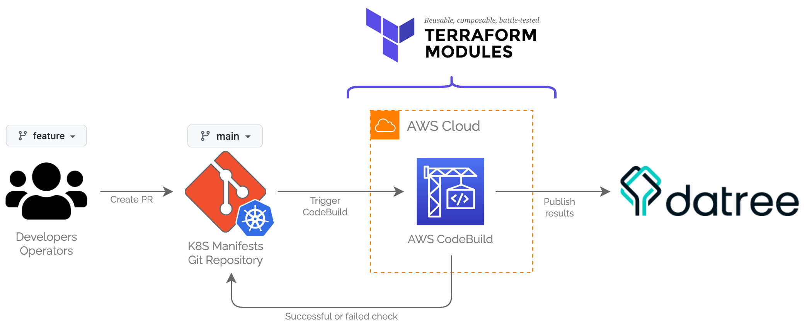

# k8s-apps

> Multi-application K8s manifests repository.

## Table of Contents

- [k8s-apps](#k8s-apps)
  - [Table of Contents](#table-of-contents)
  - [Datree policy check diagram](#datree-policy-check-diagram)
  - [Deployment Diagram](#deployment-diagram)
  - [Prerequisites](#prerequisites)

## Datree policy check diagram

## Deployment Diagram

   source: https://argo-cd.readthedocs.io/en/stable/

## Prerequisites

You will need the following tools and config properly installed on your computer.

- [Git](http://git-scm.com/)
- [Argo CD CLI](https://argo-cd.readthedocs.io/en/stable/cli_installation/)
